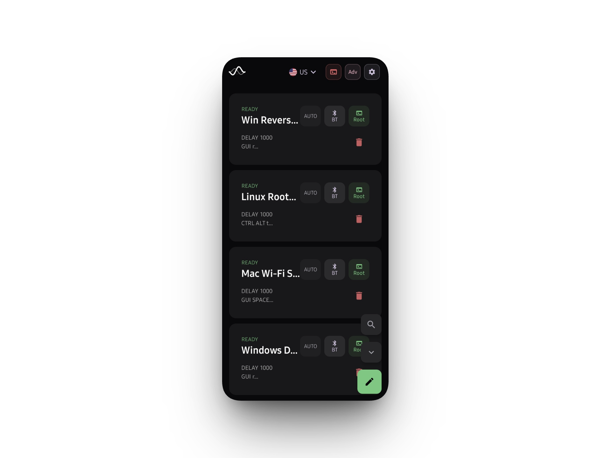

<div align="center">
  
  <h1>Chimera</h1>
  <p>Hardware Emulation & Proximity Exploitation</p>
  
  
</div>

---

### Why

Hak5 gear is heavy and obvious. My phone has a full Linux kernel in it, so I made it do the same job — HID emulation, RNDIS, mass storage, the whole thing — straight through ConfigFS. No extra hardware. No cables dangling out of a bag.

Plug into a target, pick a payload, run it. Keystrokes go to `/dev/hidg0` directly. Nothing in between.

<p align="center">
  
  
  
</p>

### What It Does

*   **Raw HID via ConfigFS** — skips Android's USB stack entirely, writes bytes straight to `/dev/hidg0`. Fast, and most EDRs see it as a generic keyboard.
*   **DuckyScript on-device** — write and run payloads from the built-in editor. No laptop needed, compiler fires interrupts on the spot.
*   **Payload library** — import `.txt` files from local storage or pull directly from the Hak5 community repo inside the app.
*   **OOB C2 via RNDIS** — phone presents itself as a USB Ethernet adapter (`usb0`) and runs a tiny web server for swapping payloads or checking status from another machine. Windows picks it up automatically. macOS is annoying about composite USB signatures, fair warning.
*   **BLE HID fallback** — USB port blocked? Switch to Bluetooth and push keystrokes over L2CAP instead.
*   **Mass storage spoof** — maps a `.bin` or `.img` to `usb_f_mass_storage`. Phone shows up as a flash drive on the target.

### Stack

Kotlin frontend, C++ for anything that touches hardware.

*   **UI** — Jetpack Compose
*   **Coroutines** — keeps char device I/O off the main thread
*   **JNI** — C++ reads `sysfs` directly to figure out what the kernel actually has compiled in

### Setup

Needs root. That's the hard requirement.

1.  Magisk, KernelSU, APatch — doesn't matter which.
2.  Kernel needs `CONFIG_USB_CONFIGFS` and `CONFIG_USB_CONFIGFS_F_HID`. Stock kernels usually don't have them. Flash NetHunter if yours doesn't.
3.  Android 11+ for BLE HID.

> BT HID works reliably across most devices. Wired ConfigFS is a different story — it depends entirely on what your OEM left in the kernel. If you get it working on something unusual (old Pixel, OnePlus, whatever), paste your `dmesg` output in the Issues tab. Trying to build a compatibility list.

### Build

```bash
git clone https://github.com/cipher-attack/chimera.git
cd chimera
# Set NDK path in local.properties first or the JNI build will fail immediately
./gradlew assembleDebug
```

### OpSec Notes

*   The target needs a second or two to mount the HID driver after you plug in. Start firing keystrokes too early and they disappear. Put `DELAY 1000` at the top of every payload.
*   Doze mode will kill background coroutines when the screen goes off. Go into battery settings and exclude Chimera, otherwise your C2 drops mid-run.

### Docs

[DOCUMENTATION.md](DOCUMENTATION.md) covers the JNI bridge and the composite USB setup in detail. Read [CONTRIBUTING.md](CONTRIBUTING.md) and [CODE_OF_CONDUCT.md](CODE_OF_CONDUCT.md) before opening a PR.

### Downloads

*   **[Release APK](https://github.com/cipher-attack/chimera/releases/latest/download/app-release.apk)** — stripped, for actual use
*   **[Debug APK](https://github.com/cipher-attack/chimera/releases/latest/download/app-debug.apk)** — verbose logs, use when ConfigFS payloads aren't working

### Contact

*   [Telegram](https://t.me/cipher_attacks)
*   [GitHub](https://github.com/cipher-attack)
*   [birukgetachew253@gmail.com](mailto:birukgetachew253@gmail.com)

**Disclaimer:** Built for authorized red team and physical security work. Get written permission before you plug into anything.

